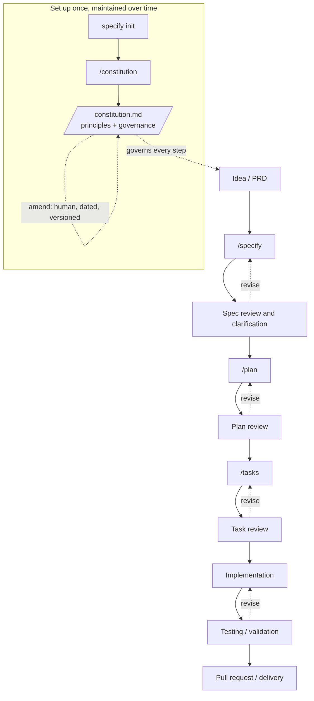

# SpecKit workflow — overview

This is a structured way to control what an AI coding tool produces. It splits a feature into ordered steps — describe intent, write a spec, plan, break into tasks, implement — and puts a human review between each one. It is not "the AI writes everything". The human owns the intent, the trade-offs, the review, and the final decisions. The AI drafts, structures, compares options, and implements, but only inside scope a human has agreed to. The steps exist so the AI's output is small and inspectable at each stage, instead of one large change you have to trust or reject whole.

One thing happens before all of this, once per project: you set up a **constitution** — the rules every later step must follow. The per-feature loop below runs many times; the constitution is set up once and reused.

## The workflow at a glance

The top box runs once when the project is set up. The rest is the per-feature loop, run once per feature. Solid arrows are the forward path; dotted arrows in the loop are the normal case — a review sends a step back to be redone before you move on. Looping back is the point, not a failure.

## Before the loop: the constitution and governance

Before any feature, you set up a **constitution** once. This is SpecKit's first
command, `/constitution`, run right after `specify init`. It is the rulebook every
later step must follow.

It holds two kinds of content:

- **Principles** — the non-negotiable rules for this project. For example: how tests
  relate to requirements, what "done" means, or limits on dependencies and complexity.
- **Governance** — how the rules themselves are managed: how decisions get recorded,
  how the constitution is amended, and who has the final say.

`/constitution` writes the file to `.specify/memory/constitution.md` from the
principles you give it. The AI can draft and structure it, but you own the rules.
Adding or changing one is a deliberate human decision, not something the AI does on
its own. (In this repo, the agent never changes the constitution's state by itself —
that is a project convention, recorded as such.)

After setup, every later command — `/specify`, `/plan`, `/tasks`, `/implement` —
reads this file to stay aligned. You set it up once and amend it rarely, on purpose.
It is not a per-feature step, which is why it sits in the "once per project" box
above rather than in the numbered steps.

### Maintaining the constitution

The constitution changes over time, but only on purpose. Treat it like a contract,
not like notes you tidy up.

- **Amend, do not quietly edit.** Record every change with a date and a reason, so the
  history of why a rule exists stays readable. Keep a short amendment log in the file.
- **A human owns the change.** Drafting help from the AI is fine, but adding, changing,
  or removing a rule is a human decision. (In this repo the agent never changes the
  constitution's state on its own — a project convention.)
- **Change on real need, not "just in case."** A rule enters when a feature actually
  forces it and leaves when it no longer holds. A rule that never binds is noise — drop
  it, and if you might need it later, write down the condition that would bring it back.
- **Keep it true.** The written constitution must match how the project really works.
  If a rule is being ignored, either follow it or change it — do not let the document
  and reality drift apart.
- **Version the change.** SpecKit uses semantic versioning in the file's footer: MAJOR
  to remove or redefine a rule, MINOR to add one, PATCH for wording fixes. Update the
  version and the "last amended" date.
- **Keep dependents in sync.** When a rule changes, update what relies on it — the
  plan/spec/task templates and any docs that repeat it — so they do not contradict the
  new rule.

Avoid treating the constitution like stale documentation you "clean up" in a quick pass.
Tidy ordinary docs that way; amend the constitution deliberately.

## How the steps connect

Each step's output is the next step's input, and nothing skips ahead.

- The **idea or PRD** is plain intent — the *what* and *why*, not the technology. A PRD is not a SpecKit command or artifact; it is just a fuller written form of that same intent. SpecKit's `/specify` can also take the intent straight from a short natural-language description.
- The **spec** sits between the PRD and the technical plan. It turns business intent into clear, testable requirements (EARS form helps here: `WHEN <condition>, THE SYSTEM SHALL <behavior>`). The plan and tasks are only as good as the spec they come from.
- The **plan** makes technical decisions — and only *after* the requirements are settled. It reads the spec, not the PRD.
- **Tasks** break the plan into units small enough to implement, test, and review one at a time.
- **Implementation** carries out the tasks; **testing** checks the result against the spec's requirements; the **pull request** is where the whole change is delivered and reviewed in context.

## Where human review happens

Review is required between major steps — it is the control, not an optional polish.

- **Spec review** — before `/plan`. Is the scope right, are the requirements testable, are gaps flagged rather than filled in silently? (`/clarify` helps surface open questions.)
- **Plan review** — before `/tasks`. Are the technical choices sound, do they match the spec, are contested ones written down (this project records them as ADRs)?
- **Task review** — before implementation. Are the tasks small, ordered, and complete?
- **Pull request** — at delivery. The standard code review, with the spec and plan as context for *why* the change looks the way it does.
- **Constitution changes** — outside the per-feature loop. Creating or amending the constitution is always a deliberate human decision, recorded on purpose.

Mapping tests back to requirements, recording ADRs, and a post-implementation closeout are conventions some projects (including this one) layer on top. SpecKit does not enforce them.

## Where Claude Code / AI coding tools are useful

Treat the AI as a collaborator that is fast at drafting and tireless at consistency checks — not as the source of truth.

- Drafting a first constitution from the principles you state — you still decide the rules.
- Drafting the first version of a spec, plan, or task list from your intent, so you edit instead of starting blank.
- Generating implementation code and tests against requirements you have already agreed.
- Comparing options ("EF Core migration vs. raw SQL here, with trade-offs") so you choose with the trade-offs laid out.
- Running checks: building, running the test suite, and cross-checking the spec, plan, and tasks for contradictions.

## Where they are dangerous

The same speed that helps in drafting hurts when nobody checks the output.

- **Inventing missing scope.** A requirement the PRD never stated gets quietly added. A gap should become a question or a written assumption, never a hidden decision.
- **Making silent decisions.** A technology, data shape, or edge-case behavior gets chosen mid-implementation with no record of why.
- **Plausible but wrong output.** A spec or a function that reads cleanly and is still incorrect. Confident phrasing is not evidence; that is what the reviews are for.
- **Being treated as the source of truth.** Once people stop reading the drafts and accept them on sight, every guarantee in this workflow is gone.
- **Quietly changing the rules.** Editing the constitution to fit the code, instead of changing the code to fit the rules. Amendments must be deliberate and human-owned.

## The steps in detail

The constitution is one-time setup, covered above; it has no numbered file. The per-feature steps each have their own file, numbered `01` through `10`. Read them in order the first time; after that, jump to the step you are on.
