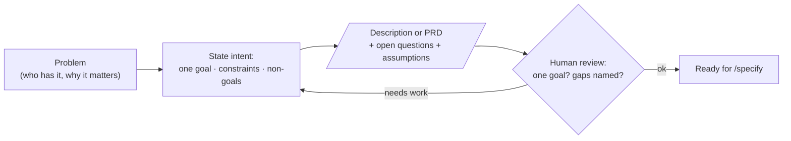

# 1. Idea / PRD

## What this step does

This is where a person says what they want and why, before any spec, plan, or
code exists. They name the problem, who has it, the one goal worth chasing, the
constraints that bound the work, and the things that are explicitly out of scope.

That intent can be a few sentences or a fuller write-up called a PRD (Product
Requirements Document). Either way, the deliverable is the same kind of thing: a
clear statement of the problem and the intended outcome, with no solution baked
in.

One thing to be clear about: **a PRD is not a SpecKit artifact.** SpecKit's
`/specify` command takes a plain natural-language description of a feature. A PRD
is just a longer, more careful version of that description. You can hand
`/specify` a paragraph or a whole PRD — it does not care which, as long as the
intent is clear. (This repo *does* require an approved PRD before `/specify`
runs, but that is a project rule, not a SpecKit rule. See the workflow overview.)

## Why this step exists

If the intent is fuzzy, everything downstream inherits the fuzz. A vague goal
produces a vague spec, which produces a plan that solves the wrong problem
precisely. Writing the intent down forces three decisions that are cheap now and
expensive later:

- **What is the one goal?** Listing five goals usually means you have not picked
  one. Downstream work needs a single thing to optimise for.
- **What is explicitly out?** Non-goals stop scope creep before it starts. They
  also tell the AI what *not* to invent.
- **What do we not yet know?** Naming open questions and assumptions up front
  means they get answered on purpose, not discovered in code review.

This step also sets the ownership boundary for the whole workflow. The human owns
scope and trade-offs here, and keeps owning them through every later step.

## What goes in

- A real problem someone has, stated in plain terms.
- Who has the problem (the user or role).
- One clear goal — the outcome that defines success.
- Constraints (time/appetite, things that must not break, regulatory or platform
  limits).
- Explicit non-goals — what is deliberately out of this slice.
- Optional: discovery notes, a workshop record, prior art, or field research that
  informed the intent.

## What comes out

- A written statement of intent — either a short description or a fuller PRD.
- A single, stated goal.
- A list of non-goals.
- A list of open questions and assumptions, each owned by someone to resolve.
- Success signals described in terms a person could later check — not yet
  formal, testable requirements (those come in the spec).

## What happens behind the scenes

Mostly nothing automated — this is human work. There is no SpecKit command for
"write the idea." No script runs, no branch is created, no template is filled by
a tool at this stage.

If you write the PRD with help from Claude Code, the AI is doing ordinary text
work: drafting prose, restructuring your notes, pointing out gaps, asking
questions. It is not running SpecKit and it is not validating anything. A
well-structured PRD is a *convention* this team follows because it makes
`/specify` easier; it is not a guarantee of correctness and nothing enforces it
but review.

The SpecKit machinery (folder/branch creation, template scaffolding) only starts
at `/specify`. Everything in this step is input to that command.

## Interaction with Claude Code / AI coding tool

- **What the human gives the AI:** the raw problem, who it is for, the goal, the
  constraints you already know, and any discovery or workshop notes. Tell it the
  appetite (how much time this is worth) so it does not over-scope.
- **What the AI is allowed to produce:** a draft PRD or a tightened description;
  reworded sections; a list of *candidate* non-goals and *candidate* open
  questions for you to accept or reject; questions where the intent is unclear.
- **What the human must review:** all of it, but especially the goal (is it
  really one?), the non-goals (are they right, not just plausible?), and any
  success signal the AI proposed — make sure it reflects what you actually want,
  not what reads well.
- **What the AI must not silently decide:** it must not invent requirements,
  success criteria, or scope. A gap becomes a written **open question** or a
  clearly labelled **assumption** — never a hidden decision dressed up as fact.
  If it does not know your incident volume, it asks or writes "Assumption: ~N/month
  (unconfirmed)", it does not pick a number and move on.

Example prompts:

- "Here are my rough notes on the problem. Draft a PRD with sections for context,
  one objective, non-goals, and open questions. Where I have not told you
  something, list it as an open question — do not guess."
- "Review this PRD. Is the objective a single goal, or several? Flag anything
  that reads like a solution rather than a problem."
- "List five things a reader might assume are in scope here that I have *not*
  said are in scope, so I can decide which to mark as non-goals."

This repo also has a `prd-writer` skill for drafting and a `prd-reviewer` skill
for checking a PRD before `/specify`. Both are project conventions (no
`speckit-` prefix), not stock SpecKit.

## Good practices

- **State exactly one goal.** If you have two, split the initiative or pick the
  one that matters this slice.
- **Write non-goals explicitly.** "No automation" or "no branching" saves a
  round of rework later.
- **Keep solutions and tech out.** The PRD says *what* and *why*. Database
  choices, frameworks, and API shapes belong in the plan, after requirements are
  clear.
- **List open questions with owners.** An unowned question does not get answered.
- **Label assumptions as assumptions.** Make it obvious which lines are confirmed
  fact and which are best guesses to validate.
- **Treat it as a draft for review.** The PRD is a starting position, not final
  truth. Expect it to change once the spec exposes edge cases.

## Things to avoid

- **Smuggling in the solution.** "We need a Redis cache" is a plan decision
  wearing a requirement's clothes. Ask what problem it solves and write that
  instead.
- **Vague success criteria.** "Make it faster" or "improve UX" cannot be tested.
  Push toward something observable, even if it stays informal until the spec.
- **A goal that is secretly five goals.** Long objective sections that span
  unrelated outcomes are the most common cause of bloated specs.
- **Letting the AI fill silent gaps.** If the tool produced a number, a metric,
  or a requirement you never stated, delete it or convert it to an open question.
- **Treating the PRD as frozen.** Skipping the review because "the AI wrote a
  thorough document" inherits any wrong assumption it made.
- **Confusing the PRD with the spec.** The PRD is business intent. The spec turns
  that intent into clear, testable requirements (often with EARS phrasing such as
  "WHEN <condition>, THE SYSTEM SHALL <behavior>"). That conversion is the next
  step's job, not this one's.

## Optional diagram

