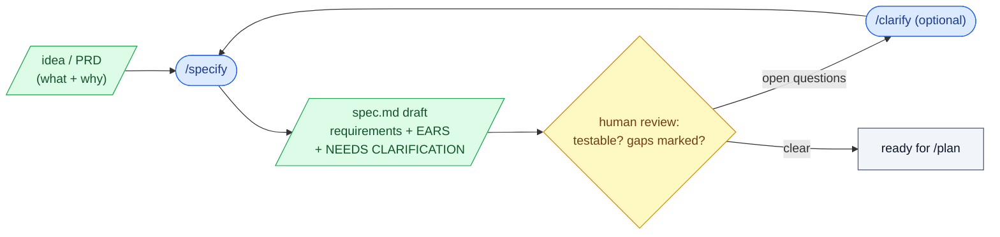

# 2. /specify

## What this step does

`/specify` turns a feature idea into a written specification: a list of testable
requirements that say *what* the system must do and *why*, with no decisions about
*how* to build it. You hand it a plain-language description (or point it at a fuller
written form of that intent, like a PRD), and it drafts a spec file with user
scenarios, requirements, and acceptance criteria.

The spec is the contract for everything downstream. The plan, the tasks, and the
code all answer to it.

## Why this step exists

Most AI coding failures start before any code is written — the request was vague, so
the model guessed. `/specify` forces the vagueness out into the open *first*, on a
page you can read in five minutes, before architecture or implementation locks the
guesses in.

It also creates a clean separation. Business intent ("responders should see what a
step means while they run it") lives in the spec. Technical choices ("render markdown
with library X, sanitize with Y") wait for `/plan`. Mixing the two is how scope and
tech decisions get smuggled in without review. Keeping them apart means a
non-engineer can check the spec for *what*, and an engineer can later check the plan
for *how*.

## What goes in

- A natural-language description of the feature — the *what* and *why*, not the tech.
- The PRD, if one exists. A PRD is not a SpecKit command or artifact; it is just a
  fuller written form of the same intent. In this repo the constitution requires an
  approved PRD before `/specify` runs (that gate is this project's addition, not stock
  SpecKit). The spec then cites the PRD as its source — see
  `specs/004-rich-steps/spec.md`, which points back to its initiative PRD.
- The project constitution, if present. It carries binding rules the spec must respect
  — for this repo, a glossary of domain terms (Runbook, Step, Execution) the spec must
  use exactly.

## What comes out

- A new spec folder and feature branch, scaffolded by the `/specify` script (for
  example `specs/004-rich-steps/` on branch `004-rich-steps`).
- A `spec.md` containing:
  - User scenarios / user stories, often prioritized.
  - Functional requirements, each individually testable.
  - Acceptance criteria, written in EARS form where a condition needs to be precise.
  - Key entities and the domain terms in play.
  - Success criteria — measurable outcomes, not implementation details.
  - An assumptions list, and any explicit out-of-scope items.
  - `[NEEDS CLARIFICATION: ...]` markers wherever the input did not settle a question.

## What happens behind the scenes

`/specify` runs a small script that does two mechanical things: it creates the spec
folder and a numbered feature branch, and it drops in a spec template (the same one
that ships in `.specify/templates/spec-template.md`). That is the entire automated
part — folders, a branch, and a fixed set of headings.

The AI then fills that template by generating text from your description and any PRD.
This is the part to be clear-eyed about: **nothing checks that the generated spec is
correct, complete, or faithful to what you meant.** The template gives the document a
predictable shape, which makes it easy to review — but the shape is a convention, not
a guarantee that the content is right. The model can phrase a requirement that sounds
clean and still be wrong about the behavior. That is precisely why a human reads it
before `/plan`.

## Interaction with Claude Code / AI coding tool

- **What the human gives the AI:** the feature description (or PRD path) — the what and
  why. Keep tech out of it.
- **What the AI is allowed to produce:** a draft spec — user stories, testable
  requirements, acceptance criteria, success criteria, and an assumptions list. It may
  restructure your intent into EARS, group requirements, and surface edge cases you
  did not mention.
- **What the human must review:** every requirement (is it testable? is it true to
  intent?), the assumptions list, the out-of-scope items, and — most important — every
  `[NEEDS CLARIFICATION]` marker. Unresolved markers are open questions, not noise to
  delete.
- **What the AI must not silently decide:** missing scope. If the description does not
  say whether a step type can be anything beyond Action and Check, the AI must mark it
  `[NEEDS CLARIFICATION]` or write it as a stated assumption — never quietly pick an
  answer and bury it in a requirement. A missing requirement becomes a question or a
  written assumption, never a hidden decision.
- **Example invocation:**

  ```
  /specify Enrich a Step beyond a single title with optional instructions
  (lightweight markdown), a command, and an expected result, plus a Step Type
  (Action or Check). Detail is frozen into the Runbook Version at publish and shown
  while running an Execution and in the Computed Review. Branching is out of scope.
  ```

  Or, pointing at the fuller written intent:

  ```
  /specify Use the PRD at docs/initiatives/04-rich-steps/prd.md as the source.
  ```

- Treat the result as a draft from a collaborator, not a finished answer. If a
  requirement is ambiguous, run `/clarify` to ask targeted questions, or edit the spec
  directly — then move on.

## Good practices

- Make every requirement testable. If you cannot picture the test that would pass or
  fail it, rewrite it. "The system MUST be fast" is not a requirement; "WHEN a Step is
  saved, THE SYSTEM SHALL persist it within 200 ms" is.
- Use EARS for any condition with a trigger or a state:
  "WHEN \<condition>, THE SYSTEM SHALL \<behavior>". Plain prose is fine for simple
  statements; reach for EARS when timing, ordering, or edge conditions matter.
- Keep the spec at the *what/why* altitude. Describe the behavior a user can observe,
  not the class, table, or library that produces it.
- Write the assumptions down. Anything you decided that the input did not state belongs
  in an explicit Assumptions section, where a reviewer can challenge it.
- State what is out of scope as plainly as what is in. A short non-goals list stops
  scope creep before `/plan` inherits it.
- Resolve `[NEEDS CLARIFICATION]` markers before `/plan`. Either answer the question
  (often via `/clarify`) or convert it into a deliberate, written assumption.
- Reuse the project's exact domain terms. If the constitution defines a glossary, the
  spec should read in those words so the plan and code stay aligned.

## Things to avoid

- **Tech choices.** No frameworks, databases, API shapes, or library names. Those are
  `/plan`'s job, after the requirements are agreed.
- **Scope creep.** Adding "while we're here" features the description never asked for.
  Each extra requirement is extra surface to plan, build, test, and review.
- **Hidden assumptions.** The worst failure mode: the AI fills a gap with a plausible
  guess and writes it as fact. Catch these in review — anything that "sounds reasonable"
  but was never stated is a candidate.
- **Untestable requirements.** Vague verbs (support, handle, manage, be reliable) hide
  behavior you cannot verify. Name the observable outcome instead.
- **Deleting clarification markers to make the spec look finished.** A clean-looking
  spec full of guesses is worse than a spec that honestly flags its open questions.
- **Skipping the review.** The structure is a convention; correctness is not automatic.
  Read the draft before running `/plan`.

## Optional diagram


