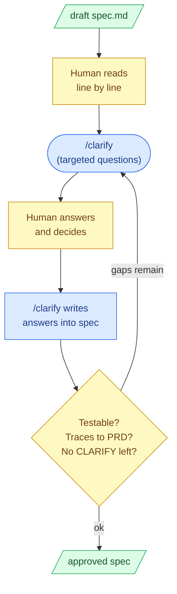

# 3. Spec review and clarification

## What this step does

A human reads the spec line by line, finds anything vague or missing, and resolves it
before any design or code starts. The `/clarify` helper supports this: it asks a few
targeted questions about the weakest parts of the spec and writes your answers back into
the spec file. You finish with a spec you have read and approved, where every requirement
is something you could write a test against.

This is a review of the draft `/specify` produced — not a new artifact. The spec stays the
single source of *what* and *why*; this step makes it trustworthy enough to plan from.

## Why this step exists

A spec is the cheapest place to fix a requirement. Changing a sentence here costs a
sentence. The same fix after `/plan` means reworking design; after `/implement` it means
reworking code and tests. Ambiguity that survives this step does not disappear — it gets
resolved later by whoever is writing code, often the AI, often silently, often wrong.

The draft from `/specify` is generated text. It can read fluently and still be incomplete,
overreach the PRD, or hide a guess inside confident wording. The review is where a human
catches that. The `/clarify` helper narrows where to look, but it does not decide anything
for you.

## What goes in

- The draft `spec.md` from step 2 (`/specify`).
- The PRD it was generated from, so you can check each requirement traces back to stated
  intent.
- The project constitution / glossary, to confirm the spec uses terms as defined (the
  rich-steps spec, for example, lists its binding glossary terms and flags a pending
  glossary amendment).
- A reviewer who understands the domain — not just the wording.

## What comes out

- A tightened spec you have read end to end and approve.
- Resolved clarification questions, with the answers written into the spec (this is what
  `/clarify` does).
- Explicit written assumptions for anything you decided not to pin down now — recorded in
  the spec's Assumptions section, not left implicit.
- Zero remaining `NEEDS CLARIFICATION` markers.
- A `Status` you are comfortable advancing from `Draft` toward ready-to-plan.

## What happens behind the scenes

`/clarify` scans the spec for underspecified areas, picks a small number of the highest-
value gaps (a handful of questions, not an interrogation), and asks them one at a time.
When you answer, it edits the spec to record the answer — usually as a refined requirement,
an EARS acceptance scenario, or an entry under Assumptions. That edit is the mechanical
part: it is text generation writing your decision into the file.

What `/clarify` does *not* do: judge whether the spec is correct, or guarantee it found
every gap. It surfaces candidates; you decide. The review itself — reading the whole spec
and approving it — is a convention this workflow relies on, not a gate the tool enforces.
SpecKit will happily let you run `/plan` on an unread spec. Nothing stops you except the
habit.

## Interaction with Claude Code / AI coding tool

- **What you give the AI:** the drafted spec and the command `/clarify`. If you already
  know a weak area, point at it ("the freeze-at-publish behavior is underspecified").
- **What the AI may produce:** clarifying questions, and — once you answer — edits that
  write your answers into the spec as requirements, acceptance scenarios, or assumptions.
  It may also flag contradictions or untestable requirements it notices while reading.
- **What you must review:** every edit `/clarify` makes, and the whole spec. Confirm each
  functional requirement is testable and traces to the PRD. Read the answers it wrote back
  and check they say what you meant.
- **What the AI must not silently decide:** it must not invent a missing requirement,
  pick a default for an open question, or quietly narrow scope. A gap becomes a question to
  you or a written assumption you approved — never a hidden choice.

Example prompts:

- `/clarify` — run the targeted question pass over the current spec.
- "List every requirement in this spec that I could not write a failing test for, and why."
- "Which of these requirements is not traceable to the PRD? Don't fix them — just flag
  them."
- "Turn the open question about markdown rendering into an explicit assumption; do not pick
  the answer for me."

## Good practices

- Read the spec line by line. Do not approve from the summary.
- For each functional requirement, ask: *what test would prove this?* If you cannot name
  one, the requirement is too vague — sharpen it. EARS phrasing helps:
  "WHEN a Runbook is published, THE SYSTEM SHALL freeze each Step's detail into the
  Runbook Version."
- Trace each requirement back to the PRD. A requirement with no PRD root is either scope
  creep or a missing PRD line — resolve which.
- Turn every unknown into one of two things: a question you answer now, or an assumption
  you write down. Nothing stays floating.
- Make assumptions specific. "Lightweight markdown means emphasis, lists, inline code, and
  links; HTML and scripts are out" is reviewable; "support markdown" is not.
- Confirm the spec stays at the *what/why* level. If a sentence is making a technical
  choice, move that decision to `/plan`.
- Re-read the sections `/clarify` edited — confirm the written answer matches your intent.

## Things to avoid

- Rubber-stamping: approving because the draft reads well and the AI sounds confident.
- Leaving any `NEEDS CLARIFICATION` marker in the spec. Each one is an unresolved decision
  that someone downstream will resolve blind.
- Letting the AI fill a gap on its own. If you did not decide it and did not write it as an
  assumption, it is a hidden decision.
- Smuggling in design. Resolving a requirement by naming a library or schema belongs in
  `/plan`, not here.
- Treating `/clarify` as the whole review. It points at a few gaps; it does not read the
  spec for you or certify completeness.
- Approving a spec you have not read end to end.

## Optional diagram

Legend: **blue** = AI command · **yellow** = human decision · **green** = document.
