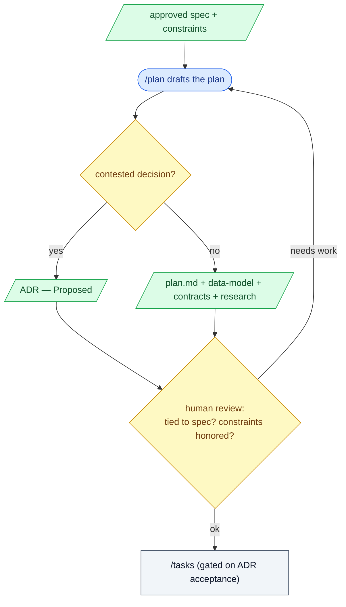

# 4. /plan

## What this step does

`/plan` decides *how* to build the feature the spec already pinned down. It takes
the approved spec plus the human's real constraints — the existing stack, the
integrations you must use, the architecture you already have — and produces a
plan with supporting design docs: data model, API contracts, and research notes.

The order matters. `/plan` runs *after* the requirements are settled, not before.
It answers "which schema, which endpoints, which rendering approach" — never
"what should this feature do." That question was closed in `/specify`.

## Why this step exists

Two failures happen when teams jump straight from idea to code:

- They make architecture decisions while the requirements are still moving, so
  the design gets rebuilt every time the "what" shifts.
- They bury the real decisions — the ones with trade-offs — inside code and
  commit messages, where no one can find or revisit them later.

`/plan` forces the design to be written down and tied back to specific
requirements *before* anyone opens an editor. It also creates a place to record
contested decisions with their rationale, so the choice is visible and can be
challenged on its own terms.

In this repo you can see the payoff in `specs/004-rich-steps/plan.md`: every
constraint it honors points at a requirement id or a numbered conflict (C-002,
C-003, C-004), and every contested choice points at an ADR. Nothing is decided
in passing.

## What goes in

- The approved spec (`spec.md`) — the requirements, in EARS form where it helps
  ("WHEN a Step is frozen, THE SYSTEM SHALL copy its detail unchanged").
- The human's real constraints: the language and framework already in use, the
  database, the deployment target, the appetite (how much time this is worth).
- Existing architecture and its conflict register — in this repo,
  `docs/architecture.md`, which lists known tensions (C-001…C-004) the plan must
  check against.
- Any standing decisions that already bind the work — earlier ADRs, the
  technology-stack ADR, the project constitution.

## What comes out

- `plan.md` — the technical approach: summary, technical context, a constitution
  check, project structure, and a scope note.
- Design docs alongside it, typically under the feature folder:
  - `data-model.md` — entities and fields being added or changed.
  - `contracts/` — the API deltas (request/response shapes).
  - `research.md` — the open questions worked through and how each resolved.
  - `quickstart.md` — an end-to-end validation walk, when useful.
- ADRs for contested decisions, marked **Proposed** until a human accepts them
  (a convention in this repo, described below).

## What happens behind the scenes

`/plan` runs a small script that sets up the feature's planning folder and drops
in a template — section headings for the plan and stubs for the design docs. The
AI then fills that template by reading the spec and constraints and generating
text.

That is the whole mechanism. The script gives structure; the AI generates words
to fit it. Neither step checks that the design is *correct*. The plan can name
the wrong table, miss a constraint, or pick a heavier approach than the spec
needs — and it will still look like a finished plan. The structure is a
convention that makes review easier, not a guarantee that the content is right.
That is precisely why a human reviews the plan before `/tasks`.

Two things in this repo are project conventions, not behavior SpecKit enforces:

- **ADRs.** Promoting a contested decision to an Architecture Decision Record is
  a habit, not a tool feature. This project goes further and makes it a hard
  gate: an ADR is drafted **Proposed**, and `/tasks` stays blocked until a human
  accepts it in its own commit (see the human-gate line at the bottom of the
  rich-steps plan).
- **Tying the plan to requirements.** The constitution-check table and the
  conflict-register check in `plan.md` are this project's discipline. SpecKit
  provides the template space; the team supplies the rule that every decision
  trace back to a requirement or a known conflict.

## Interaction with Claude Code / AI coding tool

- **What the human gives the AI:** the approved spec, the hard constraints
  ("stay on .NET 10 and React, add no new frontend runtime dependency, one
  additive migration only"), the appetite, and a pointer to existing
  architecture. Constraints are the human's job — the AI cannot guess your
  deployment target or your "no new dependency" rule.
- **What the AI is allowed to produce:** a draft plan, draft design docs, and a
  comparison of options with their trade-offs. It may recommend an option and say
  why.
- **What the human must review:** that the plan matches the spec (no new scope
  smuggled in), that constraints are actually honored, that contested decisions
  are surfaced as options rather than silently chosen, and that the design is no
  bigger than the requirements ask for.
- **What the AI must not silently decide:** anything contested — a storage shape,
  a dependency, a rendering strategy, an enum's meaning. When there is a real
  trade-off, the AI lays out the options and lets the human pick; if it must
  proceed, it records a written assumption, not a hidden choice. A missing
  requirement becomes a question, never an invented design.

Example prompts:

```
/plan
We stay on the current stack (ADR-0002). No new frontend runtime dependency —
markdown must render from an in-repo module. One additive EF Core migration only.
Appetite: a couple of evenings. Check docs/architecture.md conflict register.
```

```
For the markdown rendering decision, don't pick one — lay out the options
(in-repo renderer vs. a library) with trade-offs and a flip condition, and draft
it as a Proposed ADR for me to accept.
```

## Good practices

- Decide *how* only after the *what* is stable. If the spec is still moving, go
  back to `/specify` or `/clarify` first.
- Record each real decision with its rationale **and a flip condition** — the
  condition under which you would change your mind. The ADR template in this repo
  (`docs/adr/template.md`) has a dedicated "Flip condition" section for exactly
  this.
- Check existing constraints before designing: the conflict register, prior ADRs,
  the stack decision. Note which conflicts you touch and how.
- Keep every decision tied to a requirement. If a piece of the design serves no
  requirement, cut it or ask why it is there.
- Write a scope/appetite note with a cut-from-the-bottom priority order, so an
  overrun trims work instead of dropping quality.
- Surface options for contested calls; let the human own the trade-off.

## Things to avoid

- Planning before the spec is settled — you will redesign every time the "what"
  changes.
- Re-deciding the "what" inside the plan. The plan chooses mechanisms, not
  behavior; new behavior belongs back in the spec.
- Burying decisions in prose. A contested choice hidden in a paragraph cannot be
  reviewed or revisited — promote it to an ADR with options and rationale.
- Over-engineering for needs the spec does not state: extra tables, a new
  dependency, a generalized abstraction for a two-value enum. Earn complexity;
  don't anticipate it.
- Letting the AI silently choose a contested decision, or silently fill a gap in
  the requirements. Both must surface as an option, a question, or a written
  assumption.
- Treating the generated plan as correct because it is well-formatted. The
  template guarantees shape, not soundness.

## Optional diagram


