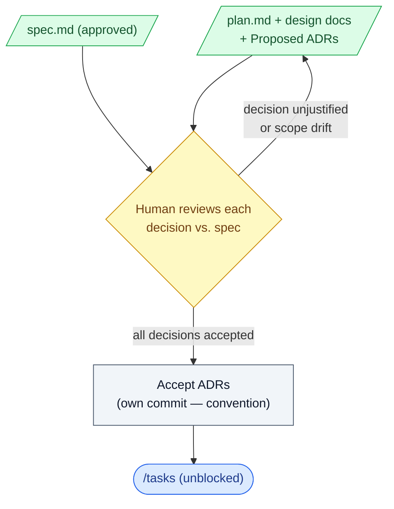

# 5. Plan review

## What this step does

A human reads the plan produced by `/plan` and decides whether it is sound: does it
actually build the spec, and are the technical choices the right ones? Nothing is
approved by reading it once and nodding. You go decision by decision — the data model,
the storage choice, the library you're about to add, the migration strategy — and you
either accept each one or send it back.

This is the last checkpoint before the work is sliced into tasks and code starts. After
this gate, changing a load-bearing decision means unpicking tasks and rewriting code.

## Why this step exists

Architecture mistakes are the expensive kind. A vague requirement caught at spec review
costs a sentence to fix. A wrong storage model or a dependency you shouldn't have added,
caught after `/implement`, costs a migration, a refactor, and a re-review.

Plan review also catches a quieter failure: a plan that reads well but doesn't match the
spec. The AI can produce a confident, tidy plan for a slightly different feature than the
one the spec describes — extra scope it invented, or a requirement it skipped. Reading the
plan against the spec is how you catch that before it becomes tasks.

It is also where you stop the AI's *default* choices from becoming *your* choices by
inertia. A plan that picks a framework, an ORM pattern, or a new library may be picking
the model's most common answer, not the one your codebase needs. The gate forces each of
those to be a decision someone made, not a default no one examined.

## What goes in

- `specs/NN-name/plan.md` — the technical plan to be reviewed.
- The design docs the plan references — for this repo that includes `data-model.md`,
  `research.md`, `contracts/`, and `quickstart.md`. Open the real files, not just the
  plan's summary of them.
- `specs/NN-name/spec.md` — the approved spec, so you can trace plan decisions back to
  requirements.
- Any ADRs the plan raised for contested decisions (in `docs/adr/`), in their Proposed
  state.
- `docs/architecture.md` and its conflict register — to check the plan against existing
  system-wide decisions and known conflicts.

## What comes out

- An approved plan, or a list of specific changes for `/plan` to redo.
- Each significant technical decision explicitly accepted by a human — not assumed,
  not approved in bulk.
- In this project: each contested decision recorded as an **Accepted** ADR. By
  convention here, ADRs are accepted in their own commit, and `/tasks` is blocked until
  they are (see "Behind the scenes"). Initiative 04 did this for ADR-0006 (markdown
  sanitization) and ADR-0007 (the closed Action/Check Step Type enum).
- An updated status in `docs/prd-register.md` (Plan), committed with the work — a
  register convention in this repo, not something SpecKit enforces.

## What happens behind the scenes

`/plan` already ran: a small SpecKit script created the design-doc files from templates,
and the AI filled them in by generating text. **Plan review adds no tool magic.** There
is no validator confirming the plan is correct, no checker proving it matches the spec.
The reading and the judgement are entirely yours. SpecKit's `/analyze` helper can compare
spec, plan, and tasks for surface inconsistencies, but that runs after `/tasks` and does
not replace a human reading the design.

The ADR-acceptance gate in this repo is a **project convention, not a SpecKit feature**.
SpecKit has no notion of an ADR and does nothing to block `/tasks`. The block here is
enforced by the constitution and by people following it: an ADR sits in Proposed, a human
reviews and accepts it (its status flips to Accepted in a dedicated commit), and only then
does task generation proceed. The commit `56549bd docs(register): record ADR-0006/0007
Accepted; tasks unblocked` in this repo's history is exactly that convention in action.

## Interaction with Claude Code / AI coding tool

- **What the human gives the AI:** the request to plan (`/plan`), and during review,
  specific questions — "why this approach over that one?", "which requirement needs this
  library?", "show me where the spec asks for this."
- **What the AI is allowed to produce:** the plan and design docs, the options it
  considered with trade-offs, draft ADRs for contested calls, and revisions when you send
  decisions back. It may recommend a default and say why.
- **What the human must review:** every load-bearing decision — data model, storage,
  new dependencies, migrations, external contracts — and whether each design doc is real
  content, not a placeholder. Confirm each decision traces to a requirement in the spec.
- **What the AI must not silently decide:** it must not add scope the spec doesn't ask
  for, adopt a dependency without flagging it, or pick an architecture and present it as
  the only option. A missing requirement is a question or a written assumption, never a
  hidden choice baked into the plan. The AI explains trade-offs; the human owns the call.
  The AI does not approve its own decisions.

Example prompts during review:

```
For each technical decision in plan.md, name the spec requirement it serves.
List anything in the plan that no requirement asks for.

You added a markdown library to data-model.md — what are the alternatives,
and what does each cost? Don't pick for me; lay out the trade-offs.

Compare the plan against docs/architecture.md and its conflict register.
Flag anything that contradicts an existing decision.
```

## Good practices

- Walk decisions one at a time. For each, ask: which requirement does this serve? If the
  answer is "none," it's either scope creep or a missing requirement — resolve it now.
- Open the design docs and read them. A `data-model.md` that's a template with the
  headings filled by hand-waving is a red flag; treat empty or generic sections as not
  done.
- Make the AI show alternatives for any decision that's hard to reverse — storage,
  schema, a new dependency. Accept the chosen option on its merits, not because it was
  first.
- Check the plan against `docs/architecture.md` and its conflict register before
  accepting, so a new decision doesn't quietly contradict a settled one.
- For contested calls, get the reasoning into an ADR while it's fresh — the *why*, the
  options rejected, and the condition that would flip the decision. ADR-0007 records why
  the Step Type enum stays closed at two values; that note stops the choice being
  re-argued later.
- Accept ADRs deliberately and in their own commit (this repo's convention), then let
  `/tasks` proceed. The separate commit makes the human sign-off visible in history.

## Things to avoid

- Approving a plan you don't fully understand. If you can't explain a decision back, you
  can't own it — ask the AI to walk you through it, or send it back.
- Letting the AI's default choices stand unexamined. "It picked X" is not a reason to
  ship X.
- Skimming the plan and skipping the design docs. The expensive details — the schema, the
  migration, the contract — live in the docs, not the summary.
- Approving a plan that doesn't trace to the spec, or that silently adds features. Match
  it against the spec before you accept.
- Treating the ADR gate as paperwork to rush. The acceptance is the human decision the
  whole step exists to capture; an unread ADR accepted to "unblock tasks" defeats it.
- Accepting a new dependency on autopilot. Each one is a long-term cost; make it a
  decision, not a side effect of the plan.

## Optional diagram


