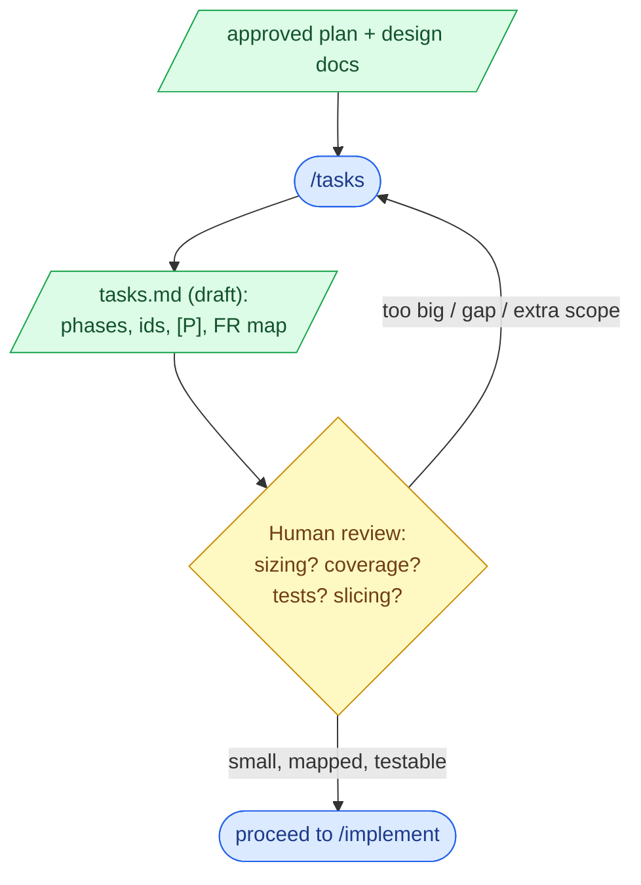

# 6. /tasks

## What this step does

`/tasks` turns the approved plan into a numbered, ordered list of work items. Each
item is small enough to implement, test, and review in one sitting. The plan says
*how* the feature will be built; the tasks list says *in what order, in what slices*,
and *which file each piece touches*.

You run it after the plan and its design docs are reviewed. SpecKit creates a
`tasks.md` from a template; the AI fills it by reading the plan, spec, data model,
and contracts, then proposing tasks grouped into phases (setup, foundational work,
then one phase per user story). You read the list and check two things: is each task
the right size, and does the list cover everything the spec asked for — no more, no
less.

## Why this step exists

A plan describes a destination. It does not, on its own, stop someone from writing
2,000 lines in a single commit that no one can review and no test exercises. Big
tasks hide risk: a "build the feature" task is impossible to estimate, easy to get
wrong quietly, and painful to revert.

Breaking the plan into small tasks does three concrete things:

- It forces a build order, so the first reviewable, shippable slice is obvious.
- It makes each piece testable — you can name the test before you write the code.
- It surfaces dependencies, so you find out *before* coding that task C can't start
  until task A's migration lands.

It also creates the last checkpoint where a human can catch missing scope cheaply.
Fixing a gap in a task list takes a minute. Finding the same gap mid-implementation
costs a rewrite.

## What goes in

- The approved, reviewed `plan.md`.
- Design docs the plan produced: `data-model.md`, `contracts/`, `research.md`,
  `quickstart.md`.
- The `spec.md`, especially its functional requirements (the FR-NNN ids) and user
  stories with their priorities (P1, P2, P3).
- Any project rules the tasks must honour — for this repo, e.g. "existing tests stay
  green and unmodified", and "tests map to requirement ids" (a constitution rule
  here, not something SpecKit enforces).

## What comes out

- A `tasks.md` file containing:
  - Tasks in dependency order, each with a stable id (`T001`, `T002`, …).
  - Tasks grouped into phases — typically Setup, Foundational (shared prerequisites),
    one phase per user story in priority order, then Polish.
  - A marker on tasks that can run in parallel (this repo uses `[P]` for "different
    file, no incomplete dependency").
  - A pointer from each task to the file(s) it touches and the requirement it serves.
  - An explicit MVP: the smallest phase set that ships something useful on its own.
  - A short dependencies/execution-order section and a build strategy (MVP first,
    then add slices).

## What happens behind the scenes

SpecKit runs a small script that creates `tasks.md` from a fixed template. The AI
then reads the plan and design docs and writes the task list into that template.

Two honest caveats:

- The structure is a **convention**, not a correctness guarantee. The template
  enforces a shape (phases, ids, a parallel marker). It does not check that the
  tasks are correctly sized, that the order actually works, or that nothing is
  missing. That check is yours.
- Mapping each test back to a requirement id, and keeping each slice independently
  shippable, are **conventions** this project follows (the constitution requires the
  test-to-requirement mapping). SpecKit does not verify either. If you want them, you
  review for them.

The AI is generating text from the plan — pattern-matching the plan into a list. It
is good at producing a complete-looking, well-ordered draft. It cannot know that a
requirement quietly dropped out, or that two tasks really touch the same file and
can't run in parallel. Treat the output as a strong first draft to be checked, not a
finished plan of record.

## Interaction with Claude Code / AI coding tool

**What the human gives the AI:** the reviewed plan and design docs, and any
constraints the tasks must respect (test mapping, "don't touch the slice-03 tests",
appetite/time box). If the plan named an MVP and a cut order, point at it.

**What the AI is allowed to produce:** the full task list — ids, phases, ordering,
parallel markers, file paths, and the requirement each task serves. It may also
suggest where to split a task it judges too large, and flag a dependency the plan
left implicit.

**What the human must review:**

- **Sizing** — could one person implement, test, and review this task in a sitting?
  If a task hides three changes, split it.
- **Coverage** — does every spec requirement (every FR id) map to at least one task,
  and does every task trace back to a requirement? Both directions matter.
- **Tests** — does work that changes behaviour have a task that tests it? A task with
  no test is a task you can't verify.
- **Slicing** — can the first phase ship on its own? Are dependencies real, or did
  they sneak in and block a slice that should stand alone?
- **No invented work** — is anything in the list that nobody asked for? Cut it or
  send it back to the spec.

**What the AI must not silently decide:** it must not drop a requirement because it
looks hard, must not add a task for scope that isn't in the spec, and must not bury a
"we'll also need to…" assumption inside a task description. A missing piece becomes a
question or a written note in the task list — never a hidden decision.

**Example prompts / commands:**

```text
/tasks
```

```text
Before I accept this list: which FR ids have no task? Which tasks have no test?
List any task you think is too big to review in one sitting and propose a split.
```

```text
Tasks T013 and T017 both say they touch RunbookEndpoints.cs — they can't both be [P].
Re-check the parallel markers against the file paths.
```

## Good practices

- **Size for one sitting.** A task you can implement, test, and review before you
  lose the thread. If you can't name its test in a sentence, it's too big.
- **Map every task to a requirement.** Put the FR id in the task. A task that serves
  no requirement is either missing context or shouldn't exist. (In this repo, tests
  carry the requirement id too — a constitution rule.)
- **Order MVP first.** The first user-story phase should be the smallest thing that
  delivers value and can ship alone. In the rich-steps example, that's US1: author
  detail and freeze it at publish; US2 and US3 only add read surfaces on top.
- **Put shared prerequisites in a Foundational phase** and gate story work behind a
  checkpoint — e.g. "existing tests pass unmodified against the migrated schema"
  before any story starts.
- **Mark parallel tasks honestly.** `[P]` means a different file and no unfinished
  dependency. Two tasks editing the same file are not parallel.
- **Name a checkpoint per phase** — the concrete thing that proves the slice works
  (run the quickstart scenario, the suite is green). It's where you stop and validate.
- **Keep a cut order.** If the work overruns, say which phase gets dropped first.
  Cut from the bottom; don't extend.

## Things to avoid

- **Vague tasks.** "Improve the run view" gives a reviewer nothing to check. Say what
  changes, in which file, to satisfy which requirement.
- **Giant tasks.** "Implement US1" is a phase, not a task. Split it into domain, data,
  endpoint, test, and UI pieces.
- **Tasks with no test** for work that changes behaviour. If nothing exercises it, you
  can't tell when it breaks.
- **Fake or hidden dependencies** that stop a slice from shipping on its own. If US2
  secretly needs US3, the slicing is wrong — fix it here, not in implementation.
- **Dropped requirements.** An FR that maps to no task is a silent gap. Check coverage
  both ways before accepting the list.
- **Invented scope.** A task for a "nice to have" the spec never mentioned is scope
  creep wearing a checkbox. Remove it.
- **Trusting the order because it looks tidy.** A clean-looking list can still have a
  task that depends on one numbered after it. Read the dependencies, don't assume them.

## Optional diagram


