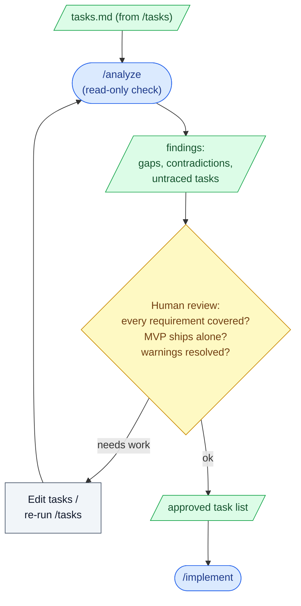

# 7. Task review

## What this step does

A human reads the task list and confirms it is the right size and complete
before any code is written. `/analyze` helps by cross-checking the spec, the
plan, and the tasks for gaps and contradictions — but the person makes the call.
This step runs after `/tasks` and before `/implement`. When it passes, you have
an approved task list you are willing to build against.

## Why this step exists

`/tasks` produces an ordered list, but order is not the same as completeness.
Two failures slip through if no one looks:

- A requirement in the spec has **no task** that delivers it. The build finishes,
  the tests are green, and the feature is still missing a behavior the spec asked
  for.
- A task exists that **maps to no requirement**. Someone added scope that nobody
  agreed to, or a leftover from an earlier draft of the plan.

This is the last cheap moment to catch both. Fixing a missing or extra task here
is editing a line of Markdown. Catching it during `/implement` means throwing
away code; catching it in review means a round trip; catching it in production
means an incident. The gate is here because everything downstream is more
expensive.

## What goes in

- `tasks.md` — the ordered task list from `/tasks` (the thing under review).
- `spec.md` — so you can check every requirement traces to a task.
- `plan.md` — so you can check tasks match the technical approach that was agreed.
- Any ADRs accepted at `/plan` — tasks should not contradict an accepted decision.

## What comes out

- An **approved task list** the team agrees to implement.
- A short record of any changes made (tasks added, removed, split, or reordered)
  and why — usually a re-run of `/tasks` or a manual edit, committed with the work.
- Resolved `/analyze` findings, or a written note explaining why a flagged item
  is acceptable to leave.

## What happens behind the scenes

`/analyze` reads `spec.md`, `plan.md`, and `tasks.md` together and reports where
they disagree: a requirement with no covering task, a task with no source
requirement, a task that conflicts with the plan or an accepted ADR, duplicated
or contradictory items. It is **read-only** — it reports, it does not edit the
files. You decide what to change.

Running `/analyze` at this point is a **convention**, not something the tool
forces. The standard flow lets you go straight from `/tasks` to `/implement`;
this gate is a habit the team chooses because it is cheaper than finding the same
problems later. The report itself is generated text comparing three documents —
it can miss things and it can flag things that are fine. Treat it as a careful
second reader, not a verdict.

The mapping from requirements to tasks (and later from tests to requirements) is
also a convention this project keeps. SpecKit does not enforce that every
requirement has a task; a human does.

## Interaction with Claude Code / AI coding tool

- **What the human gives the AI:** the three artifacts already on disk (spec,
  plan, tasks) and the instruction to run the consistency check.
- **What the AI is allowed to produce:** an `/analyze` report listing gaps,
  contradictions, and untraced tasks; and, if you ask, a re-generated or edited
  `tasks.md` to fix a specific finding.
- **What the human must review:** every `/analyze` finding, the full task list
  against the spec's requirements, and whether the first slice of tasks ships a
  usable MVP on its own.
- **What the AI should not silently decide:** it must not drop a requirement,
  invent a task that has no basis in the spec or plan, or quietly "smooth over" a
  contradiction. A gap becomes a reported finding or a written assumption — never
  a hidden choice.

Example prompts and commands:

```
/analyze
```

```
For each functional requirement in spec.md, list the task IDs in tasks.md
that deliver it. Flag any requirement with zero tasks, and any task that
maps to no requirement. Do not edit any files.
```

```
Which tasks make up the smallest slice that delivers a working feature?
List them and tell me what is NOT in that slice.
```

## Good practices

- **Trace every requirement to at least one task.** Walk the spec's requirements
  list and point each one at a task ID. If you use EARS — "WHEN `<condition>`, THE
  SYSTEM SHALL `<behavior>`" — each such statement should have a task that builds
  it and, by convention, a test that proves it.
- **Trace every task back to a requirement.** A task that points at nothing in the
  spec or plan is scope creep or dead weight. Cut it or justify it in writing.
- **Confirm the MVP slice stands alone.** Identify the smallest set of tasks that
  ships something usable, and check it does not depend on a "phase 2" task to
  function. If it cannot ship by itself, re-slice.
- **Check task size.** Each task should be small enough to implement, test, and
  review on its own. Split anything that bundles several behaviors.
- **Resolve `/analyze` warnings before coding.** Either fix the finding or write
  one line saying why it is acceptable. Do not carry an open warning into
  `/implement`.
- **Re-run `/analyze` after edits.** If you change tasks to fix a finding, run it
  again so the change did not introduce a new gap.

## Things to avoid

- **Approving tasks that do not trace to a requirement.** If you cannot name the
  requirement a task serves, it does not belong in this build.
- **Ignoring `/analyze` output.** A report you do not read is the same as not
  running it. Read each finding and decide.
- **Skipping the gate because "it looks fine".** The list looking reasonable is
  exactly the case this step is for — the missing requirement is the one that does
  not jump out.
- **Treating `/analyze` as approval.** A clean report means three documents agree
  with each other, not that the plan is right. Human judgment still decides.
- **Letting the AI patch contradictions on its own.** When a task conflicts with
  the plan or an accepted ADR, the human resolves which one is correct — not the
  tool.
- **Padding the list for completeness.** Adding tasks "to be safe" creates work
  nobody asked for. Match the agreed scope, no more.

## Optional diagram


