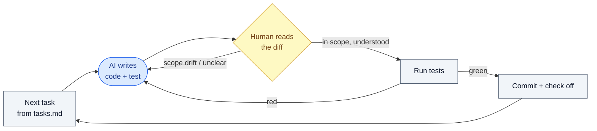

# 8. Implementation

## What this step does

This is where the code gets written. `/implement` works through the approved
tasks file in order — for each task, the AI writes the code and tests the plan
calls for, then checks the task off. The earlier steps decided *what* to build,
*how*, and *in what order*; this step does the building, one task at a time,
inside the boundaries already agreed.

The key idea: the AI is executing an agreed list, not making fresh decisions. If
a task is well written, implementing it should hold no surprises. If it does hold
a surprise, that is a signal the spec or plan was thin — not a licence to improvise.

## Why this step exists

Without an ordered, reviewed task list driving the work, AI code generation
drifts. You ask for a small change and get a refactor of three unrelated files, a
new dependency, and a data-model tweak nobody approved. By the time you notice,
the diff is too large to review honestly, so it gets waved through.

This step exists to keep generation on rails. Every line of code traces back to a
task, every task traces back to a requirement, and every diff is small enough that
a human can actually read it. The control is not "trust the AI"; the control is
"the work is small, scoped, and reviewable."

## What goes in

- The approved `tasks.md` — the ordered, reviewed list of tasks.
- The `spec.md` and `plan.md` they came from (the AI re-reads these for context).
- The project constitution (coding standards, testing rules, scope limits).
- The existing codebase and its current passing tests.
- Any accepted ADRs that constrain how a task is built.

## What comes out

- Working source code that implements the tasks.
- New tests that cover the new behavior, mapped to the requirement IDs they prove
  (this mapping is a project convention, not something the tool enforces).
- Tasks checked off in `tasks.md` as they are completed.
- A series of small commits — ideally one per task or per small group of related
  tasks — each reviewed before the next.
- Existing tests still green.

## What happens behind the scenes

`/implement` reads `tasks.md` and walks the tasks in order. For each one, the AI
generates code and tests that it judges to satisfy that task, following the plan
and the constitution. It marks tasks done as it goes.

What this is **not**: it is not a compiler, and it is not a guarantee of
correctness. The AI is producing text it predicts fits the task. Nothing in
SpecKit verifies that the code is right — the only checks that bite are the tests
you run and the diff you read. Treating `/implement` as "the AI builds it, I
collect it" is exactly the failure mode this whole workflow is built to prevent.

Running tests after each task and keeping the prior tests green are workflow
conventions enforced by your CI and your habits, not by the `/implement` command
itself. SpecKit gives you the ordered list and fills in the code; you supply the
judgement.

## Interaction with Claude Code / AI coding tool

**What the human gives the AI**

- The approved tasks file, and a clear instruction on *how much* to do — one task,
  or a small named group, not "do everything."
- Pointers to the constitution and plan if the session has lost that context.

**What the AI is allowed to produce**

- Code and tests for the tasks in front of it.
- A note or question when a task is ambiguous, under-specified, or conflicts with
  something it found in the code.

**What the human must review**

- Every diff, before committing. Read it like you would a colleague's pull request:
  does it do what the task said, and nothing else?
- The new tests — do they actually test the requirement, or do they just assert
  whatever the code happens to do?
- That existing tests still pass and were not edited to make new code go green.

**What the AI must not silently decide**

- It must not add features, endpoints, config, or dependencies the tasks did not
  call for.
- It must not change the data model, schema, or public API shape beyond what the
  plan specified.
- It must not "fix" or rewrite existing tests to accommodate new code.
- A missing requirement becomes a question or a written assumption — never a quiet
  decision buried in a diff.

**Example prompts**

- `/implement` — runs the task list; pair it with a scope limit in plain language.
- "Implement only task T012. Stop after it and show me the diff and the new test."
- "Implement T020 through T023 — they're the same surface. Don't touch the schema;
  the plan didn't change it. If you think you need to, ask first."
- "Tests T031 expects are failing. Fix the code under test. Do not modify the test."

## Good practices

- Implement one task, or one small related group, then stop and review. Resist
  the urge to let it run the whole list unattended.
- Commit small — roughly one commit per task or tight group — so each diff is
  reviewable and easy to revert.
- Run the test suite after each chunk. Keep every existing test green; a red test
  you did not expect is information, not an obstacle.
- Read every diff in full. If you cannot explain what a line does, do not commit it.
- When the AI surfaces a question or an assumption, resolve it in the spec or plan
  and re-derive — do not just answer it in chat and move on.
- Check tasks off only when their code and tests are in and passing.

## Things to avoid

- Letting the AI run unbounded across many tasks and reviewing only at the end —
  the diff becomes too big to read, so review stops being real.
- Accepting code you do not understand because it compiles and the tests are green.
- Scope drift: extra "while I'm here" changes, new dependencies, refactors of
  untouched files.
- Changing the data model or API shape without going back through the plan (and an
  ADR if it is contested).
- Editing or deleting existing tests to make new code pass — that hides regressions
  instead of catching them.
- Treating a checked-off task as proof of correctness. The checkbox means "the AI
  did the work"; the passing test and your review mean "the work is right."

## Optional diagram

The loop is deliberately tight: one task, one diff, one review, one commit — then
back for the next.
