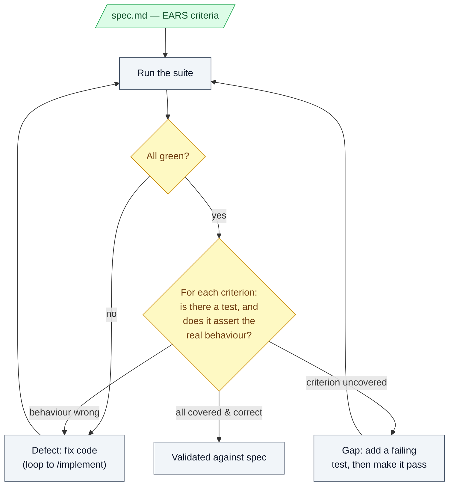

# 9. Testing / validation

## What this step does

You run the test suite and check the running behaviour against the spec's
acceptance criteria. Two separate jobs:

1. **Tests pass.** The automated suite is green.
2. **The behaviour matches the spec.** Each acceptance criterion in `spec.md`
   is actually satisfied — not just "no test failed", but "the thing the
   requirement asked for happens".

The output of `/implement` is code plus tests. This step is where you confirm
that code does what the requirement said, and that the green checkmark means
what you think it means.

## Why this step exists

A passing test suite is not proof the feature is correct. It is proof that the
tests that exist pass. Those are different claims, and the gap between them is
where bugs hide:

- A test can pass because its assertion is weak (`result != null` when the spec
  demanded a specific value).
- A requirement can have no test at all, so nothing breaks when it is violated.
- A test can be written against what the code *does* instead of what the spec
  *asked for* — it locks in the implementation, including its mistakes.

This step exists to close that gap deliberately. The spec gave you testable
requirements (EARS criteria are written precisely so you can check them one by
one). Validation here means walking that list and confirming each one, rather
than trusting an aggregate "all green".

## What goes in

- The implemented code and its tests (from `/implement`).
- `spec.md` — specifically the acceptance scenarios / EARS criteria.
- `tasks.md`, if your tasks recorded which requirement each test covers.
- Any `quickstart.md` or contract files that describe expected behaviour.
- A way to run the suite (here: `dotnet test backend/tests/RunbookPlatform.Api.Tests`).

## What comes out

- A green test suite that you have actually read, not just watched go green.
- A pass/fail check against each acceptance criterion in the spec.
- A short note of anything the spec asked for that has no test covering it.
- A list of any behaviour gaps: criteria the code does not meet, raised as
  defects to fix (loop back to `/implement` or `/tasks`) rather than papered over.

## What happens behind the scenes

The test runner runs your tests. That is all the tool guarantees — it executes
test code and reports pass/fail. It has no idea what your requirements are, and
it cannot tell you whether a test checks the right thing.

The idea that "each test maps to a requirement" is a **convention you maintain**,
not something SpecKit or the test framework enforces. Nothing in the pipeline
links a test to a spec line. If you want that link, you create it: name the test
after the criterion, or reference the requirement ID in a comment or the task.
A green suite with zero requirement coverage is entirely possible and the tool
will not warn you.

So "behind the scenes" is honest and dull: tests run normally. The validation —
reading what the assertions check, and matching them to the spec — is human work
that the AI can assist with but cannot certify.

## Interaction with Claude Code / AI coding tool

- **What the human gives the AI:** the spec's acceptance criteria and the
  request to map existing tests to them, or to write tests for criteria that
  lack coverage. Point it at `spec.md` explicitly.
- **What the AI is allowed to produce:** new test cases tied to named
  requirements, a coverage table (criterion → test → covered/not), a run of the
  suite, and a plain-English read of what each test asserts.
- **What the human must review:** that each test actually checks the requirement
  and is not gamed. Read the assertions. A test named `Test_Publish_Freezes_Detail`
  that only asserts the request returned 200 does not prove the detail was frozen.
- **What the AI should not silently decide:** it must not weaken an assertion,
  mark a test `[Skip]`/`[Ignore]`, delete a failing test, or loosen the expected
  value to reach green. If a test fails, the default is that the code is wrong,
  not the test. If the AI thinks the test is wrong, it says so and asks — it does
  not quietly change it. A missing requirement becomes a question or a written
  assumption, never a hidden edit.
- **Example prompts:**
  - "List every EARS criterion in specs/004-rich-steps/spec.md and, for each,
    name the test that covers it or mark it uncovered."
  - "Criterion US1.5 (earlier Runbook Version's detail unchanged after
    republish) has no test. Write a failing test for it first, then show me the
    failure before you touch any code."
  - "This test asserts only that the call succeeded. Rewrite it to assert the
    frozen `expectedResult` equals what the author published."

## Good practices

- **See it fail first.** For any new test, watch it fail before you make it
  pass. A test that has never failed may be asserting nothing.
- **Validate against the spec, not the code.** Open `spec.md` and check
  behaviour against what was asked. Do not derive "correct" from what the
  implementation happens to do.
- **Name or link each test to its requirement.** e.g. a test for US1.2 ("accept
  only Action or Check, reject any other value") should be findable from that
  criterion. This is the convention that makes coverage auditable.
- **Read assertions, not just the summary line.** Open the tests behind the
  green and confirm each one checks a real, specific outcome.
- **Check the negatives.** EARS criteria with "SHALL reject" or "SHALL provide
  no path" need tests that the bad case is actually refused — e.g. that modifying
  a published Runbook Version's detail genuinely has no route (US1.6).
- **Track uncovered criteria openly.** If a requirement has no test, write that
  down as a gap. Do not let "all green" hide it.

## Things to avoid

- Skipping, ignoring, or commenting out a failing test to get a green run.
- Weakening an assertion (broad type checks, `>= 0`, "not null") so a check
  passes without proving the behaviour.
- Deleting a test because it is inconvenient rather than because the requirement
  changed.
- Writing the test after the code by copying the code's output into the expected
  value — that asserts the bug, not the requirement.
- Trusting "all tests pass" without reading what they assert.
- Treating coverage of happy paths as enough while the spec's rejection and
  immutability criteria go untested.
- Letting the AI mark a requirement "validated" — a human confirms that.

## Optional diagram

