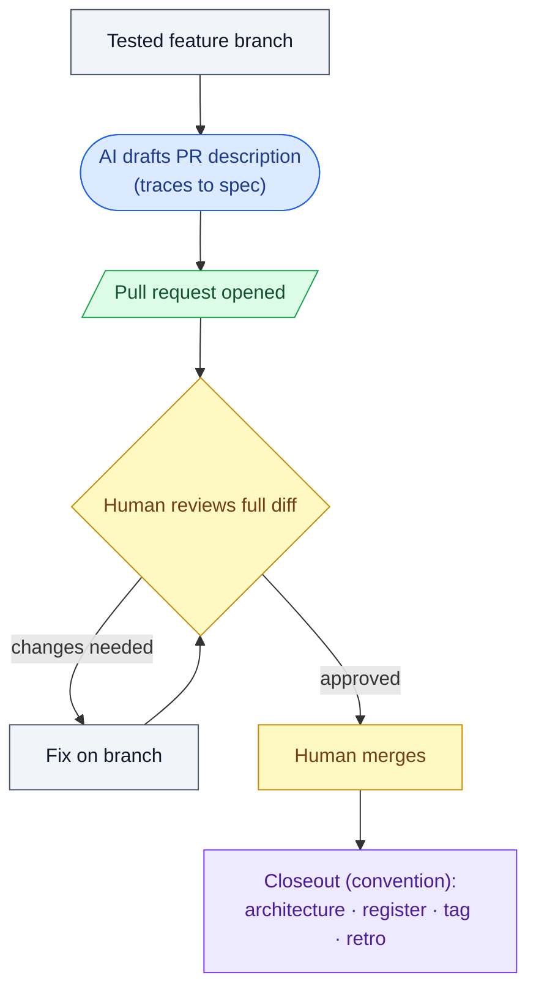

# 10. Pull request / delivery

## What this step does

You open a pull request from the feature branch, get a human to review the
full diff, merge it, and deliver the change. This is the last human gate
before the work lands on the main branch. In this project there is also a
closeout afterwards: update shared architecture docs, tag a release if the
project tags releases, and write a short retro. Closeout is a project
convention, not something SpecKit does.

## Why this step exists

Everything up to here happened on a branch, in isolation. Merging is the
moment the change becomes everyone's problem and everyone's dependency. A
review at this point catches what the earlier per-step reviews could not see:
the whole change as one diff, in the context of the current main branch.

It also prevents the most tempting shortcut with AI-assisted work — "the AI
wrote it and the tests pass, so just merge it." Tests passing and a human
agreeing the change is correct, scoped, and safe are two different things.
The PR is where the second one happens.

## What goes in

- The implemented, tested feature branch (all tasks done, tests green).
- The spec, plan, and tasks for the feature (so the PR can trace back to them).
- Any ADRs accepted for this feature.
- The list of files the change actually touches.

## What comes out

- A pull request with a description that traces back to the spec.
- A human review of the full diff (approve, or request changes).
- A merged PR on the main branch.
- The delivered change.
- Closeout artifacts this project expects (convention): an amended
  `docs/architecture.md`, an updated `docs/prd-register.md` status, a release
  tag where applicable, and a short retro.

## What happens behind the scenes

The AI can draft the PR title and description by reading the spec, plan,
tasks, and the diff, then writing prose that explains what changed and why.
That is text generation over the artifacts you already have — it is not a
guarantee the description is accurate or the diff is correct. You read both.

Opening, reviewing, approving, and merging the PR are actions a human takes
in the Git host (or via `gh`). The AI does not approve its own work and does
not merge it. Nothing in SpecKit enforces this; it is a rule worth stating
plainly because the AI is perfectly capable of running the commands.

The closeout (architecture amendment, release tag, retro) is a convention
this project adds after the standard SpecKit flow. SpecKit ends at
`/implement`; the steps after merge are the repo's own discipline, recorded
in `CLAUDE.md` and the constitution, not behavior the tool provides.

## Interaction with Claude Code / AI coding tool

- **What the human should give the AI:** the branch, the spec/plan/tasks
  paths, and a request to draft the PR description. Optionally, your team's
  PR template.
- **What the AI is allowed to produce:** a PR title and body that summarize
  the change and cite the spec/requirements it implements; a draft retro; a
  draft architecture-doc amendment for you to edit.
- **What the human must review:** the full diff line by line, the PR
  description against the actual change, and that the diff contains *only*
  this feature — no unrelated edits, no leftover debug code, no stray
  reformatting.
- **What the AI should not silently decide:** to include unrelated changes in
  the PR, to widen scope beyond the spec, to approve or merge, or to skip the
  closeout because the merge "felt done." A gap or surprise becomes a comment
  or a question, not a quiet inclusion.
- **Example prompts / commands:**
  - "Draft a PR description for this branch. Trace each major change back to
    a requirement in `specs/004-rich-steps/spec.md`. List anything in the
    diff that isn't covered by the spec."
  - "Open the PR with `gh pr create` using that description. Do not merge."
  - "Draft the `docs/architecture.md` amendment and a 5-line retro for this
    feature."

## Good practices

- Keep the PR scoped to one feature. If you spot an unrelated fix, branch it
  separately rather than smuggling it in.
- Write the description so a reviewer can trace it to the spec: which
  requirements does this satisfy, and how. Link the spec, plan, and any ADRs.
- Review the full diff yourself, not just the summary. The AI's summary can
  be confidently wrong about what the code does.
- Call out test coverage in the PR: which tests map to which requirements
  (mapping tests to requirements is a convention this project follows).
- Do the closeout while context is fresh — amend architecture docs, update
  the register status to its final state, tag the release, write the retro.
- Let a second person review when you can, especially for AI-heavy diffs.

## Things to avoid

- Bundling unrelated changes (refactors, formatting, "while I was in here"
  edits) into the feature PR.
- Skipping or rubber-stamping review because the AI wrote the code and the
  tests are green.
- Letting the AI approve or merge its own work.
- Writing a description that describes intent but doesn't match the diff.
- Treating "merged" as "done" when the project expects a closeout — an
  un-updated `architecture.md` or register entry leaves the next initiative
  starting from stale facts.
- Merging with open review comments unaddressed and no record of why.

## Optional diagram

