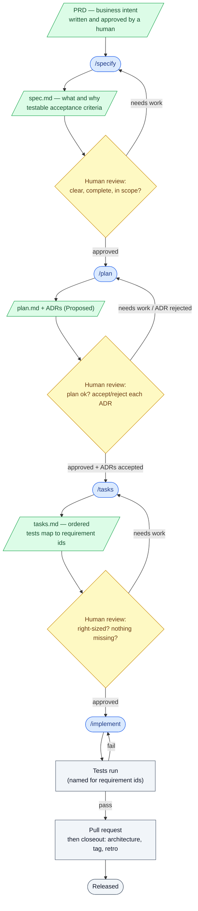

# SpecKit workflow: PRD → implementation

The point of SpecKit: turn vague business intent into clear, testable requirements
**before** any architecture or code. You decide *what* and *why* first, lock it with a
human, then move to *how*.

**Two rules hold at every step:**

1. **A human reviews between steps.** Each command produces a draft; a person checks
   it before the next command runs. The arrows that loop back are not failures — they
   are the normal way work tightens.
2. **The AI never invents missing scope.** If something is unclear or absent, it marks
   the gap (and asks) — it does not quietly fill it in. Silent guessing is the main
   thing this process exists to prevent.

## The flow

Legend: **blue** = AI command · **yellow** = human gate · **green** = document ·
**grey** = action/result.

---

## Step by step

Each step lists: what it does · in · out · behind the scenes · do · avoid.

### 1. PRD
- **Does:** States the problem, who it's for, the scope, and the non-goals. The
  approved starting point.
- **In:** Discovery notes and workshop output (the agreed words for things).
- **Out:** `docs/initiatives/NN-name/prd.md`, approved by a human.
- **Behind the scenes:** Not a SpecKit command — written and reviewed by people. The
  rules block `/specify` if no approved PRD exists.
- **Do:** Make non-goals explicit. Keep one clear appetite. Answer the workshop's open
  questions here.
- **Avoid:** Putting solutions or architecture in the PRD. Starting `/specify` without one.

### 2. `/specify`
- **Does:** Turns the PRD into a formal spec — numbered requirements and testable
  acceptance criteria.
- **In:** The approved PRD path.
- **Out:** `specs/NNN-name/spec.md`; register status → Specify.
- **Behind the scenes:** A script scaffolds the spec folder and branch; the skill fills
  the spec template; the agent-context note may refresh.
- **Do:** Write each requirement so a test could prove it (WHEN … THE SYSTEM SHALL …).
  Mark anything unknown as NEEDS CLARIFICATION.
- **Avoid:** Adding scope the PRD didn't ask for. Choosing tech here.

### 3. Spec review (human)
- **Does:** A person checks the spec is clear, complete, and matches the PRD.
- **In:** `spec.md`.
- **Out:** Approved spec, or change requests (loop back to `/specify`).
- **Behind the scenes:** `/clarify` can ask a few targeted questions and write the
  answers back into the spec.
- **Do:** Confirm every requirement is testable and traces to the PRD.
- **Avoid:** Rubber-stamping. Letting NEEDS CLARIFICATION items through.

### 4. `/plan`
- **Does:** Decides *how* to build it. Promotes contested decisions to ADRs, marked
  Proposed.
- **In:** Approved spec; the architecture conflict register.
- **Out:** `plan.md` (+ research, data model, contracts); ADRs as Proposed; register → Plan.
- **Behind the scenes:** A script sets up the plan; the skill checks the conflict
  register and states which conflicts this work touches. If a choice needs information
  the documents don't contain, it **asks** rather than picks.
- **Do:** Record real decisions as ADRs, each with a flip condition. Check the conflict
  register.
- **Avoid:** Burying decision rationale in the plan. Silently picking when the docs
  don't settle it.

### 5. Plan review + ADR acceptance (human)
- **Does:** A person reviews the plan and accepts or rejects each ADR.
- **In:** `plan.md` + Proposed ADRs.
- **Out:** Each ADR flipped to Accepted (or Rejected) in its own human commit; plan
  approved.
- **Behind the scenes:** `/tasks` is **blocked** while any referenced ADR is still
  Proposed. The AI never flips an ADR's status itself.
- **Do:** Decide each ADR on purpose. Keep the written status true.
- **Avoid:** Running `/tasks` with Proposed ADRs. Accepting an ADR the AI flipped.

### 6. `/tasks`
- **Does:** Breaks the plan into an ordered, testable task list.
- **In:** Approved plan + accepted ADRs.
- **Out:** `tasks.md` — phased, dependency-ordered, tests mapped to requirement ids;
  register → Tasks.
- **Behind the scenes:** A script sets up tasks; they're grouped by phase/user story and
  include a closeout phase.
- **Do:** MVP first. Map each test to a requirement id. Mark tasks that can run in
  parallel.
- **Avoid:** Vague tasks. Dependencies that stop a slice from shipping on its own.

### 7. Task review (human)
- **Does:** A person checks the breakdown is right-sized and complete.
- **In:** `tasks.md`.
- **Out:** Approved tasks, or revisions (loop back to `/tasks`).
- **Behind the scenes:** `/analyze` can cross-check spec, plan, and tasks for gaps and
  contradictions.
- **Do:** Confirm the MVP ships on its own. Confirm nothing is missing.
- **Avoid:** Approving a task that doesn't trace back to a requirement.

### 8. Implementation (`/implement`)
- **Does:** Works through the tasks in order, writing code and tests.
- **In:** Approved `tasks.md`.
- **Out:** Working code + tests; tasks checked off; register → Implement.
- **Behind the scenes:** Follows the engineering rules — earned complexity, testable
  criteria, tests mapped to ids. Regression checks keep earlier tests green.
- **Do:** Commit per task or logical group. Keep older tests passing, unchanged.
- **Avoid:** Adding complexity no requirement asked for. Editing old tests to make new
  code pass.

### 9. Testing
- **Does:** Runs the suite; each test is named for the requirement it covers.
- **In:** The implemented code.
- **Out:** Green suite, or failures (loop back to implementation).
- **Behind the scenes:** Earlier suites must stay green and unmodified — that proves old
  behavior still holds.
- **Do:** See a test fail before you make it pass. Keep the suite green.
- **Avoid:** Skipping tests. Weakening a check just to go green.

### 10. PR + closeout
- **Does:** Opens the pull request. After merge, runs the closeout the rules require.
- **In:** The implemented, tested branch.
- **Out:** Merged PR; architecture updated; release tagged; retro written; register →
  Released.
- **Behind the scenes:** The next initiative does not start until this closeout is done.
- **Do:** Update the conflict register. Tag in release order. Write the retro line.
- **Avoid:** Skipping closeout. Starting the next initiative before this one is released.

---

## The one-line version

PRD (agreed problem) → spec (testable *what*) → plan (*how* + recorded decisions) →
tasks (ordered work) → code → tests → PR. A human signs off between each step, and the
AI flags gaps instead of guessing.
