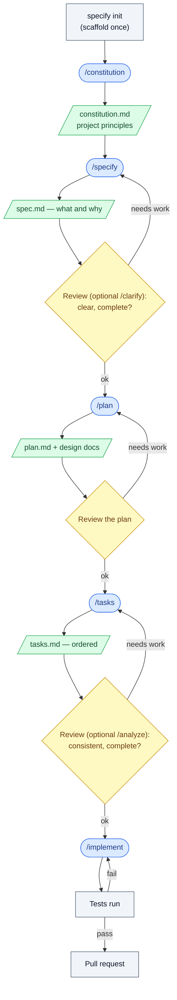
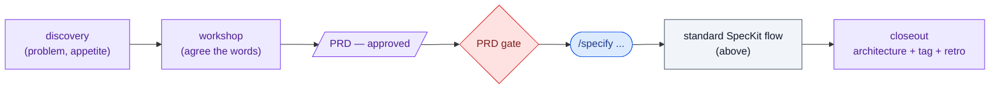

# SpecKit workflow: spec to implementation

The point of SpecKit: turn vague intent into clear, testable requirements **before** any
architecture or code. You decide *what* and *why* first, then *how*, then build.

**Two habits hold throughout:**

1. **Review between steps.** Each command produces a draft. Read it before running the
   next one. The loop-back arrows are normal — that's how the work tightens.
2. **The AI flags gaps; it does not invent scope.** If something is unclear or missing,
   it says so (and asks). It does not quietly fill it in.

> Note: standard SpecKit *recommends* the reviews and gives you tools for them
> (`/clarify`, `/analyze`), but it does not force them. The hard gates in this repo
> (a required PRD, human ADR acceptance) are this project's own additions — see the last
> section.

---

## The standard SpecKit flow

This is stock SpecKit, the same for any project.

Legend: **blue** = AI command · **yellow** = human review · **green** = document ·
**grey** = action/result.

### Optional helpers
- **`/clarify`** — targeted questions to tighten the spec (before `/plan`).
- **`/analyze`** — consistency check across spec/plan/tasks (before `/implement`).
- **`/checklist`** — generate a quality checklist for the feature.

These support the human reviews; they don't replace them.

---

## This project's pre-pipeline layer (for showcase)

This repo wraps the standard flow with a **custom front layer** to demonstrate the work
that happens *before* and *around* SpecKit. **None of this is stock SpecKit** — the repo's
own `CLAUDE.md` states: *"docs/ is NOT part of the Spec Kit SDD flow."*

What the layer adds, and why it's not standard:

- **Discovery → workshop → PRD** in `docs/initiatives/NN-name/`, written and checked with
  custom skills (`prd-writer`, `prd-reviewer` — note: no `speckit-` prefix, so not stock).
  This shows the upfront thinking before a feature is specified.
- **A PRD gate.** This project's constitution requires an *approved PRD* before
  `/specify` runs. Stock SpecKit lets `/specify` start from a plain description with no
  PRD. This is the biggest difference.
- **ADRs as a hard gate.** At `/plan`, contested decisions become ADRs marked Proposed; a
  human accepts each in its own commit, and `/tasks` is blocked until they're accepted
  (custom skill: `adr-reviewer`). Standard SpecKit has no such gate.
- **A register + closeout.** `docs/prd-register.md` tracks status, and after `/implement`
  the project requires a closeout — amend the architecture, tag a release, write a retro —
  before the next initiative starts.

In short: the standard flow is the engine; this layer is scaffolding around it to show the
full lifecycle — from a rough business problem, through SpecKit, to a released and recorded
change.

---

## One-line version

**Standard SpecKit:** `/constitution` → `/specify` → `/plan` → `/tasks` → `/implement`,
with a human review between each (helped by `/clarify` and `/analyze`).
**This repo adds:** a PRD (and a gate) in front, ADR acceptance inside, and a closeout
after — to showcase the work around the pipeline.
